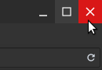
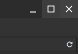
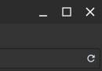
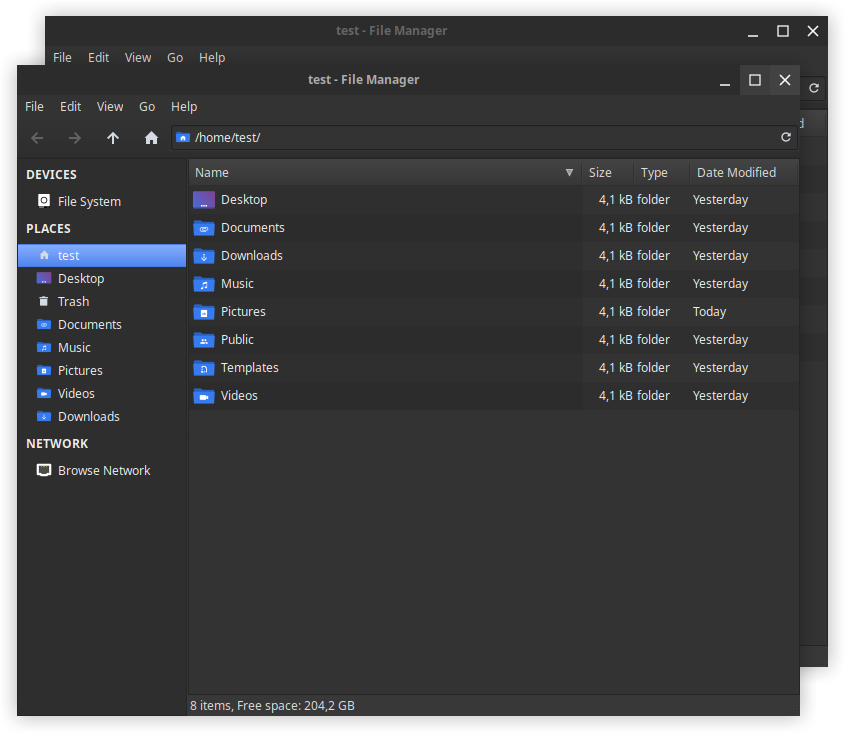

# BlackbirdFlat

A flat theme inspired by [ChrButtons](https://github.com/paullinuxthemer/ChrButtons) with a smaller window title bar. Designed to fit the XFCE4 Blackbird theme.

  

Icon theme used: [Flat-Remix-Dark](https://github.com/daniruiz/flat-remix)

### Issue: grab area to resize windows is very small

This happens because in Xfwm the grab area is defined by the theme. There exists an open [bug report](https://bugzilla.xfce.org/show_bug.cgi?id=11808) that is open since mid 2015. The easiest workaround apart from changing the theme is to use the combination `Alt + Right Click` to resize the windows.
